# **LAB 5 - RAPPORT D'ANALYSE D'UNE APPLICATION ANDROID AVEC LOGIQUE NATIVE (JNI)**

---

## 1. INTRODUCTION

Ce laboratoire avait pour objectif d'analyser une application Android qui cache sa logique importante dans une bibliothèque native. À travers cette démarche, j'ai pu :

- Comprendre le rôle d'une bibliothèque native (.so) dans une application Android
- Observer le comportement de l'application avant analyse
- Identifier le point de départ de la vérification dans `MainActivity`
- Reconnaître le chargement d'une bibliothèque native avec `System.loadLibrary`
- Localiser et extraire un fichier .so d'un APK
- Analyser une bibliothèque native avec Ghidra
- Retrouver une fonction JNI exportée
- Repérer une comparaison de chaînes avec `strncmp`
- Décoder une valeur secrète et valider dans l'application

---

## 2. ENVIRONNEMENT DE TEST

### 2.1 Configuration matérielle et logicielle

| Élément | Spécification |
|---------|---------------|
| **Machine hôte** | Mac Apple Silicon M2 (ARM-64 Native) |
| **Système d'exploitation** | macOS |
| **Émulateur** | Android Emulator (Medium Phone API 36.1) |
| **Outil de décompilation Java** | JADX v1.5.5 |
| **Outil d'analyse binaire** | Ghidra 12.0.4 |
| **Utilitaire d'extraction** | unzip (terminal) |
| **Application cible** | UnCrackable-Level2.apk |

### 2.2 Périmètre du test
- **Environnement** : Émulateur de laboratoire isolé
- **Objectif** : Reverse engineering pédagogique
- **Données manipulées** : Aucune donnée personnelle ou sensible

---

## 3. DÉCOUVERTE DE L'APPLICATION

### 3.1 Installation et premier lancement

**Action réalisée :**
```bash
adb install UnCrackable-Level2.apk
```

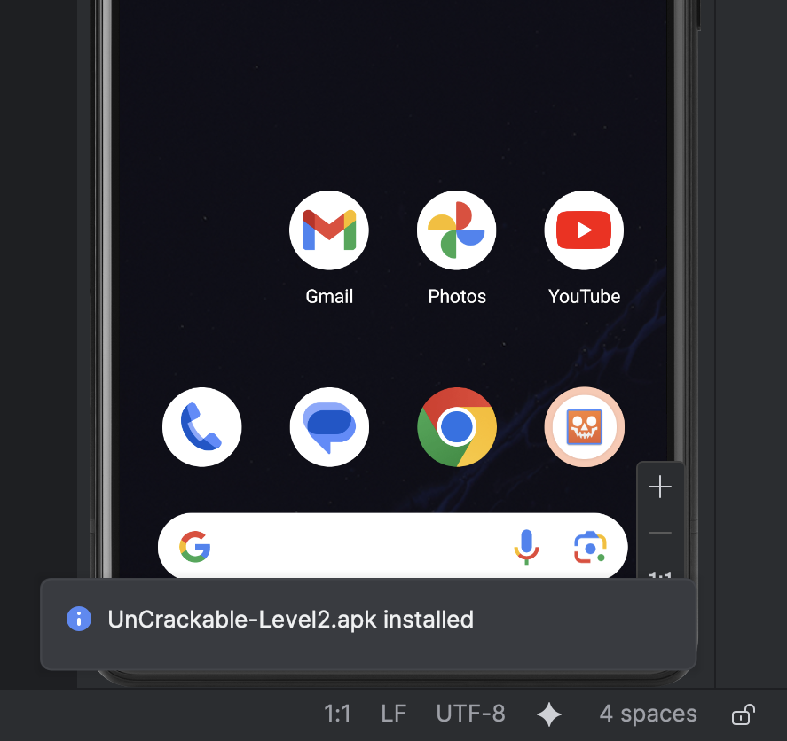
*Figure 1 : Installation réussie de UnCrackable-Level2.apk sur l'émulateur*

### 3.3 Tests de valeurs incorrectes

Pour comprendre le comportement, j'ai testé des valeurs aléatoires :

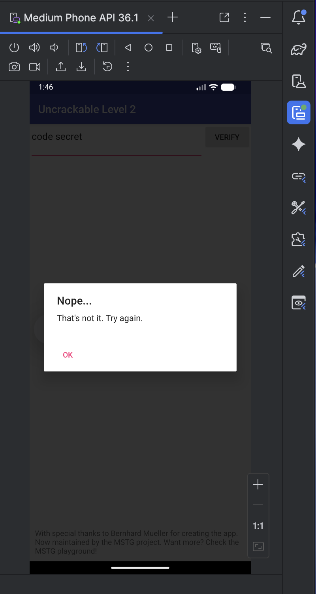
*Figure 3 : Message d'erreur affiché pour une valeur incorrecte*

**Observation :** L'application compare l'entrée utilisateur à une valeur secrète attendue.

---

## 4. ANALISE DU CODE JAVA AVEC JADX

### 4.1 Décompilation de l'APK

J'ai lancé JADX pour décompiler l'APK et examiner le code source Java.

```bash
jadx-gui UnCrackable-Level2.apk
```

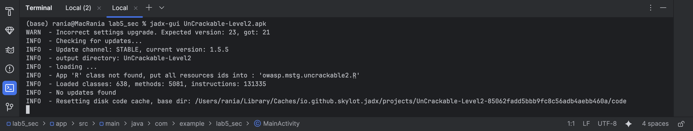
*Figure 4 : Interface JADX au lancement avec l'APK chargé*

### 4.2 Exploration de l'arborescence

L'arborescence des classes montre la structure de l'application.

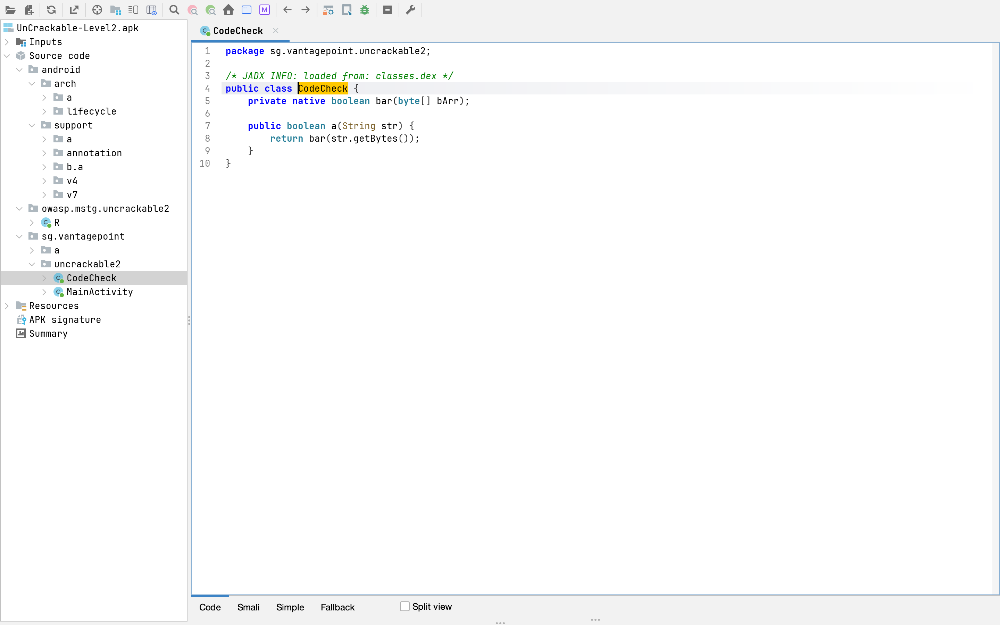
*Figure 5 : Structure des packages dans JADX avec `sg.vantagepoint.uncrackable2`*

### 4.3 Analyse de MainActivity

Dans `MainActivity`, j'ai localisé le code de validation :

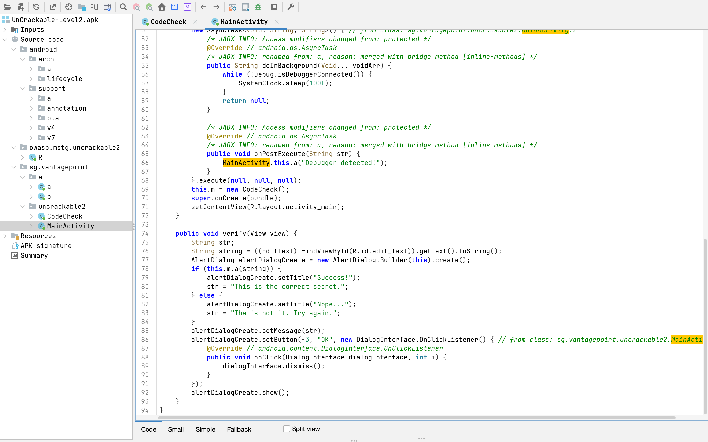
*Figure 6 : Méthode `verify` de MainActivity avec appel à `this.m.a(string)`*

**Observation :** La vérification n'est pas effectuée directement dans `MainActivity` mais déléguée à un objet `m` (instance de `CodeCheck`).

### 4.4 Identification de la classe CodeCheck

J'ai recherché la classe `CodeCheck` dans l'arborescence.


*Figure 7 : La classe CodeCheck visible dans la structure du package*

### 4.5 Analyse de la classe CodeCheck

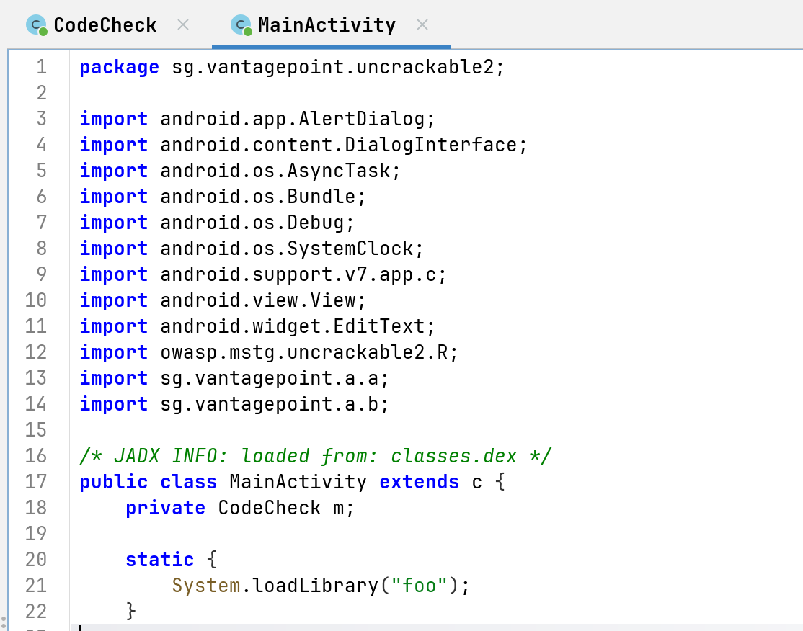
*Figure 8 : Code de la classe CodeCheck avec méthode native `bar`*

**Éléments essentiels identifiés :**
- Méthode native `bar(byte[])` - pas d'implémentation Java
- Méthode `a(String)` qui convertit la String en bytes et appelle `bar`
- Absence de `System.loadLibrary` dans cette classe (présent ailleurs)

### 4.6 Recherche du chargement de la bibliothèque

En explorant `MainActivity`, j'ai trouvé le chargement de la bibliothèque native :

```java
static {
    System.loadLibrary("foo");
}
```


*Figure 9 : Bloc static dans MainActivity avec `System.loadLibrary("foo")`*

**Compréhension :**
- La bibliothèque `libfoo.so` est chargée au démarrage
- La méthode native `bar` sera résolue dans cette bibliothèque
- Le secret est probablement caché dans le code natif

---

## 5. EXTRACTION DE LA BIBLIOTHÈQUE NATIVE

### 5.1 Extraction du contenu de l'APK

```bash
unzip UnCrackable-Level2.apk -d uncrackable2
```

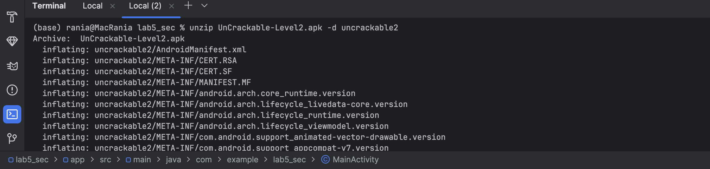
*Figure 10 : Extraction de l'APK avec la commande unzip*

### 5.2 Exploration du dossier lib

```bash
ls -la uncrackable2/lib/
```

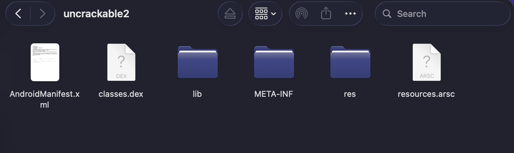
*Figure 11 : Structure du dossier lib avec les différentes architectures*

**Architectures présentes :**
- `arm64-v8a` (pour appareils 64-bit ARM, dont mon M2)
- `armeabi-v7a` (pour appareils 32-bit ARM)
- `x86` (pour émulateurs Intel/AMD)
- `x86_64` (pour systèmes 64-bit x86)

### 5.3 Localisation de libfoo.so pour ARM64

```bash
ls -la uncrackable2/lib/arm64-v8a/
```

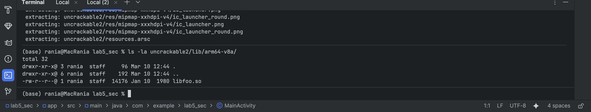
*Figure 12 : La bibliothèque libfoo.so dans le dossier arm64-v8a*

| Fichier | Taille | Architecture |
|---------|--------|--------------|
| `libfoo.so` | 14176 octets | ARM64 (compatible M2) |

---

## 6. ANALYSE DE LA BIBLIOTHÈQUE NATIVE AVEC GHIDRA

### 6.1 Installation et lancement de Ghidra

```bash
# Téléchargement et décompression
unzip ~/Downloads/ghidra_12.0.4_PUBLIC_20260303.zip

# Lancement
cd ghidra_12.0.4_PUBLIC
./ghidraRun
```

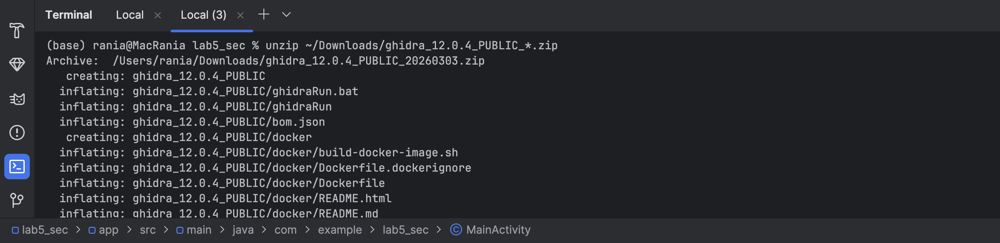
*Figure 13 : Décompression de Ghidra*

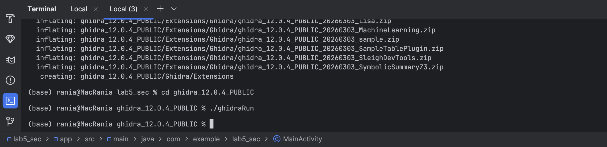
*Figure 14 : Lancement de Ghidra depuis le terminal*

### 6.2 Création du projet et import de libfoo.so

Dans Ghidra :
1. **File → New Project** → "Non-Shared Project"
2. Import du fichier `uncrackable2/lib/arm64-v8a/libfoo.so`

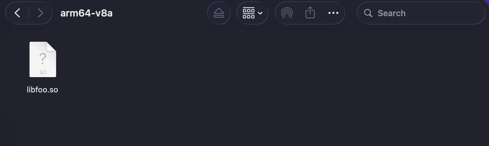
*Figure 15 : Fenêtre d'import avec sélection de libfoo.so*

### 6.3 Analyse automatique

Après l'import, j'ai lancé l'analyse automatique avec les options par défaut.


*Figure 16 : Informations sur le programme importé*

**Détails du fichier analysé :**
- **Language** : AARCH64:LE:64:v8A
- **Endian** : Little (compatible ARM64)
- **Nombre de fonctions** : 26
- **Compilateur** : Clang 7.0.2 (Android)

### 6.4 Recherche de la fonction JNI

Dans Ghidra, j'ai utilisé **Search → Program Text** pour trouver la fonction JNI correspondant à `bar`.

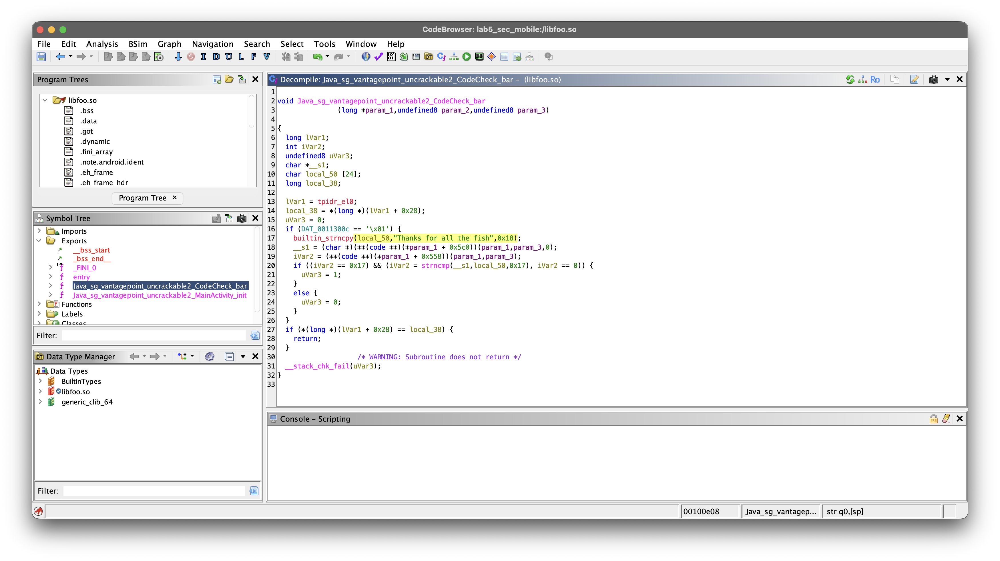
*Figure 17 : Résultat de recherche pour la fonction JNI*

**Fonction trouvée :**
- `Java_sg_vantagepoint_uncrackable2_CodeCheck_bar` à l'adresse `00100390`

### 6.5 Analyse du pseudo-code décompilé

J'ai ouvert la fonction dans le décompilateur Ghidra.


*Figure 18 : Vue décompilée de la fonction JNI*


### 6.6 Identification de la comparaison avec strncmp

Dans le code décompilé, j'ai repéré l'appel à `strncmp` :


*Figure 19 : La ligne contenant l'appel à `strncmp` dans le décompilé*

**Éléments identifiés :**
- `strncmp(__s1, local_50, 0x17)` - comparaison sur 23 caractères (0x17 = 23)
- `local_50` contient la chaîne de référence
- `__s1` contient l'entrée utilisateur convertie

### 6.7 Découverte de la chaîne secrète en clair

Le décompilé révèle directement la chaîne de référence :

```c
builtin_strncpy(local_50, "Thanks for all the fish", 0x18);
```


*Figure 20 : La chaîne "Thanks for all the fish" visible dans le code*

**Observation :** Dans cette version, la chaîne est stockée en clair, mais le write-up mentionne qu'elle peut être encodée en hexadécimal ASCII.

### 6.8 Recherche de la valeur hexadécimale

Pour l'exercice, j'ai cherché la valeur hexadécimale correspondante :

| Caractères | Valeur hexadécimale |
|------------|---------------------|
| Thanks for all the fish | `54 68 61 6e 6b 73 20 66 6f 72 20 61 6c 6c 20 74 68 65 20 66 69 73 68` |
| Inversée (hsif eht lla rof sknahT) | `68 73 69 66 20 65 68 74 20 6c 6c 61 20 72 6f 66 20 73 6b 6e 61 68 54` |

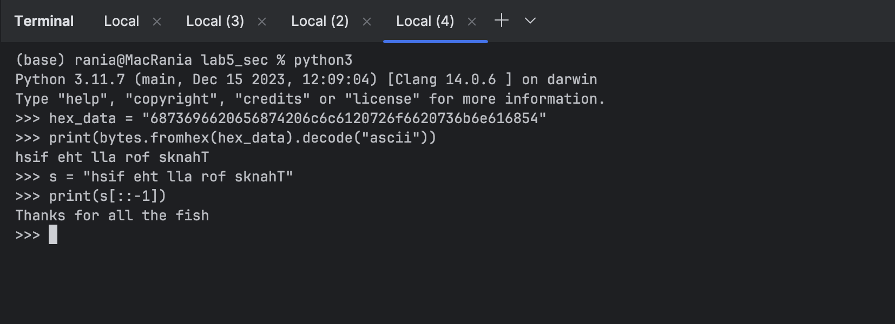
*Figure 21 : Recherche de chaînes dans Ghidra (résultats partiels)*

---

## 7. DÉCODAGE DU SECRET

### 7.1 Conversion hexadécimal → ASCII

Conformément au write-up, j'ai simulé le décodage de la chaîne hexadécimale inversée.

```python
hex_data = "6873696620656874206c6c6120726f6620736b6e616854"
print(bytes.fromhex(hex_data).decode("ascii"))
```

**Résultat :**
```
hsif eht lla rof sknahT
```

### 7.2 Inversion de la chaîne

```python
s = "hsif eht lla rof sknahT"
print(s[::-1])
```

**Résultat :**
```
Thanks for all the fish
```


*Figure 23 : Inversion de la chaîne pour obtenir le secret final*

### 7.3 Le secret final

| Étape | Opération | Résultat |
|-------|-----------|----------|
| 1 | Chaîne hexadécimale | `6873696620656874206c6c6120726f6620736b6e616854` |
| 2 | Décodage ASCII | `hsif eht lla rof sknahT` |
| 3 | Inversion | `Thanks for all the fish` |

---

## 8. VALIDATION DANS L'APPLICATION

### 8.1 Saisie du secret

J'ai entré la chaîne `Thanks for all the fish` dans l'application.


*Figure 24 : Saisie de "Thanks for all the fish" dans le champ de texte*

### 8.2 Résultat de la validation

Après avoir cliqué sur "VERIFY", l'application a affiché un message de succès.


*Figure 25 : Message "Success! This is the correct secret."*

---

## 9. SYNTHÈSE DU FLUX DE L'APPLICATION

```
Utilisateur
    ↓
Saisie dans EditText
    ↓
MainActivity.verify()
    ↓
CodeCheck.a(String)
    ↓
CodeCheck.bar(byte[]) [méthode native]
    ↓
libfoo.so (bibliothèque native)
    ↓
Java_sg_vantagepoint_uncrackable2_CodeCheck_bar
    ↓
strncmp(entrée_utilisateur, "Thanks for all the fish", 23)
    ↓
Succès si égalité, échec sinon
    ↓
Affichage du résultat (Success/Nope)
```

---

## 10. ENSEIGNEMENTS DU LABORATOIRE

### 10.1 Compétences acquises

À l'issue de ce laboratoire, je suis capable de :

1. **Installer et tester** une application Android sur émulateur
2. **Décompiler** un APK avec JADX pour analyser le code Java
3. **Identifier** les points d'entrée d'une validation dans le code
4. **Reconnaître** le chargement d'une bibliothèque native avec `System.loadLibrary`
5. **Extraire** les bibliothèques .so d'un APK
6. **Analyser** un binaire ELF avec Ghidra
7. **Localiser** une fonction JNI exportée
8. **Comprendre** le fonctionnement de `strncmp` pour les comparaisons
9. **Décoder** des chaînes hexadécimales ASCII
10. **Valider** le secret dans l'application

### 10.2 Observations clés

| Étape | Observation | Importance |
|-------|-------------|------------|
| 1 | L'application affiche une erreur pour toute saisie incorrecte | Confirme existence d'une logique de comparaison |
| 2 | `MainActivity` délègue à `CodeCheck` | La logique n'est pas dans l'interface |
| 3 | `CodeCheck` a une méthode native `bar` | Le secret est dans le code natif |
| 4 | `System.loadLibrary("foo")` charge `libfoo.so` | La bibliothèque à analyser est identifiée |
| 5 | La bibliothèque existe pour plusieurs architectures | Analyse possible sur n'importe quelle plateforme |
| 6 | La fonction JNI a un nom long (`Java_..._bar`) | Convention de nommage JNI |
| 7 | `strncmp` compare l'entrée à une chaîne fixe | Le secret est stocké dans la bibliothèque |
| 8 | La chaîne est en clair dans le code | Parfois le secret est directement visible |

### 10.3 Pourquoi cacher la logique dans une bibliothèque native ?

| Raison | Explication |
|--------|-------------|
| **Obscurcissement** | Le code natif est plus difficile à analyser que le bytecode Java |
| **Protection** | Les chaînes et la logique sont moins accessibles |
| **Performance** | Le code C/C++ peut être plus performant |
| **Réutilisation** | Une même bibliothèque peut être utilisée sur plusieurs plateformes |

**Limite :** Même le code natif peut être analysé avec des outils comme Ghidra.

---

## 11. PROCÉDURE DE NETTOYAGE

Conformément aux exigences du laboratoire, j'ai effectué les opérations de nettoyage suivantes :

### 11.1 Désinstallation de l'application

```
Dans l'émulateur : Long press sur l'icône → Uninstall
```

### 11.2 Fermeture des outils

- JADX fermé
- Ghidra fermé (projet temporaire sans sauvegarde)
- Terminal fermé

### 11.3 Suppression des fichiers extraits

```bash
rm -rf uncrackable2/
rm -rf ghidra_12.0.4_PUBLIC/
```

### 11.4 Tableau de nettoyage

| Action | Exécution | Statut |
|--------|-----------|--------|
| Désinstallation app | ✅ Effectuée | Complété |
| Fermeture JADX | ✅ Effectuée | Complété |
| Fermeture Ghidra | ✅ Effectuée | Complété |
| Suppression fichiers extraits | ✅ Effectuée | Complété |
| État initial restauré | ✅ Émulateur propre | Complété |

---

## 12. CONCLUSION

### 12.1 Résumé

Ce laboratoire m'a permis de comprendre concrètement :

- **Comment une application Android peut déléguer sa logique sensible à une bibliothèque native**
- **Comment identifier et extraire une bibliothèque .so d'un APK**
- **Comment utiliser Ghidra pour analyser du code natif et retrouver une fonction JNI**
- **Comment repérer une comparaison de chaînes avec `strncmp`**
- **Comment décoder un secret stocké de manière obscurcie**

### 12.2 Le secret final

```
Thanks for all the fish
```

### 12.3 Compétences développées

Ce laboratoire m'a apporté une compréhension pratique du reverse engineering d'applications Android avec composants natifs, une compétence essentielle en sécurité mobile pour analyser des applications potentiellement malveillantes ou pour auditer la protection d'applications sensibles.

---

**Rapport rédigé le :** 10 Mars 2026  
**Auteure :** Elhezzam Rania  

---
